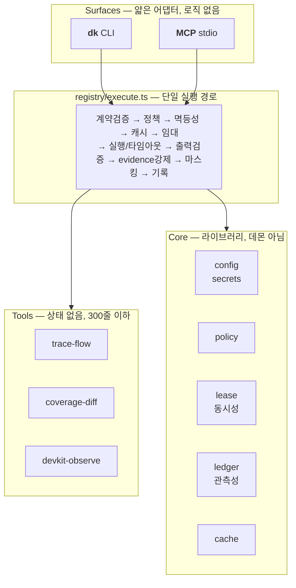

# devkit

**AI 에이전트가 호출·디버깅·수정할 수 있는 개발 사이클 보조 툴체인.**

1인 개발자가 티켓 이해 → 타당성 검토 → 설계 문서 → 구현 → 테스트 → 리뷰 → 릴리스 → 모니터링
전 단계에서 쓰는 도구를, **에이전트가 안전하게 동시에 쓸 수 있는 형태**로 묶는다.

```bash
dk run trace-flow --input '{"repo":"my-service","entry":"POST /v1/orders"}'
```

---

## 왜 만드는가

AI 에이전트로 개발할 때 반복되는 두 가지 문제가 있다.

1. **에이전트가 코드베이스를 매번 처음부터 탐색한다.** `Bash`/`Read`를 수백 번 호출하고,
   그 결과가 컨텍스트를 부풀리고, 세션이 길어지고, 매 턴 같은 컨텍스트가 재처리되면서
   비용이 폭발한다.
2. **AI가 만든 산출물의 근거가 남지 않는다.** 그럴듯한 코드를 받았는데 검증할 방법이 없어서
   통과시키고, 리뷰나 운영에서 터진다.

devkit은 이 둘을 정면으로 겨냥한다:

| 전략 | 어떻게 |
|---|---|
| **탐색 제거** | 한 번 분석해 커밋 SHA 기준으로 캐시한다. 툴 1회 호출이 탐색 N회를 대체한다 |
| **근거 강제** | 모든 툴은 `evidence`(파일:라인, 커밋 SHA, 실행 쿼리)를 반환해야 한다. **없으면 결과 자체가 반환되지 않는다** |
| **세션 분리를 공짜로** | 새 세션 시작 비용을 없애서, 컨텍스트가 부푼 세션을 억지로 끌 이유를 없앤다 |

자세한 설계 배경과 의사결정은 [`plan.md`](plan.md)에 있다.

---

## 설치

### 요구사항

- **Node.js 24 이상** — `node:sqlite` 내장, TypeScript 직접 실행에 필요
- macOS (Keychain 연동 사용). Linux는 시크릿 해석 부분만 조정하면 동작한다
- **npm 의존성 없음.** `npm install`이 필요 없다

```bash
git clone https://github.com/woo972/tools.git devkit
cd devkit

# PATH 등록 (~/.zshrc 또는 ~/.bashrc)
export PATH="$PWD/bin:$PATH"

dk doctor      # 환경 진단
```

`dk doctor`가 각 문제마다 고치는 명령을 함께 알려준다.

### 초기 설정

```bash
dk init        # ~/.devkit/config.toml 생성
```

```toml
# ~/.devkit/config.toml
default_profile = "personal"

[repos.my-service]
path = "~/projects/my-service"
lang = ["kotlin"]
framework = ["spring-boot"]
entrypoint_globs = ["**/*Controller.kt", "**/*Listener.kt"]

[policy]
deny_tools = []
allow_prod_writes = false
```

> **시크릿은 절대 설정 파일에 평문으로 넣지 않는다.** `keychain://<service>/<account>` 참조만 쓴다.
> 값은 실행 시점에 macOS Keychain에서 해석되고, 로그·에러·실행 기록에는 마스킹되어 남는다.

### 동작 확인

```bash
./scripts/selfcheck.sh    # end-to-end 17개 검증 (격리된 임시 환경)
npm test                  # 단위/통합 52개
```

---

## 툴 목록

### 사용 가능

| 툴 | 역할 | 부수효과 |
|---|---|---|
| **`repo-map`** | 저장소의 타입·메서드·엔드포인트·의존성 인덱스 생성. 커밋 SHA 기준 캐시 → 에이전트의 반복 탐색을 대체한다 ([상세](tools/repo-map/README.md)) | read |
| **`trace-flow`** | 엔드포인트 → 다운스트림 호출 그래프. 트랜잭션 경계·DB 테이블·외부 시스템·리스크 포인트 ([상세](tools/trace-flow/README.md)) | read |
| **`devkit-observe`** | 툴 사용 현황·자원 점유·실패 패턴 조회. **에이전트가 자기 자신과 다른 에이전트의 작업 상태를 파악**하는 통로 | read |
| **`context-pack`** | 현재 작업 상태를 **4KB 이하 브리핑**으로 압축. 새 세션의 첫 프롬프트로 그대로 붙여 쓴다 → 세션 분리 비용을 없앤다 ([상세](tools/context-pack/README.md)) | read |
| **`echo`** | 툴 계약의 참조 구현. 새 툴을 만들 때 복사해서 시작한다 | read |

### 로드맵

| 툴 | 역할 | 단계 |
|---|---|---|
| **`impact-scan`** | 변경 심볼의 영향 반경 — 호출자, 테이블, 외부 시스템, 이벤트, 플래그 | M2 |
| `contract-diff` | API/DTO/이벤트 스키마 diff + 파괴적 변경 분류 | M4 |
| `doc-scaffold` | ADR/HLD/LLD 초안을 근거 인용 상태로 생성 | M4 |
| **`test-plan`** | 영향 반경에서 테스트 매트릭스 도출 (멱등성·TTL·동시성·외부 장애) | M3 |
| `test-run` | 빌드/테스트 래퍼. 실패만 구조화 출력 + flaky 감지 + 워크트리 격리 | M3 |
| **`coverage-diff`** | **변경된 라인만** 커버리지 집계. 게이트 역할 | M3 |
| `review-lens` | 룰팩 기반 자가 리뷰 (SQL 안전성·트랜잭션 범위·N+1·신뢰 경계) | M6 |
| `release-check` | 마이그레이션 되돌림 가능성·플래그 상태·설정 diff·롤백 플랜 | M6 |
| `monitor-probe` | APM/로그 쿼리 래퍼. 배포 전후 에러율 델타 | M6 |

> 이 목록은 로드맵이지 약속이 아니다. **30일간 실제로 안 쓰인 툴은 삭제한다.**

### 함께 사는 서비스

툴(`dk run ...`)과 달리 상주 프로세스로 도는 것들.

| 이름 | 역할 | 진입점 |
|---|---|---|
| **`config-provider`** | 서버 주소·비밀번호·API 키·도메인 용어를 한곳에서 관리하고 로컬에만 제공한다. 본인은 UI로 원본 평문을 즉시 보고, 에이전트에게는 화이트리스트를 통과한 값만 나간다. sops+age 암호화, UDS 데몬, MCP 서버 ([설치·사용](packages/config-provider/README.md) · [에이전트용](packages/config-provider/AGENTS.md)) | `dkc`, `dkc-mcp` |

```bash
dkc resolve 입고지시                                   # 자연어 → key
dkc exec --with PGPASSWORD=DB_PASSWORD -- psql ...     # 값을 안 보고 명령만 실행
```

---

## 사용 방법

### 기본

```bash
dk list                                    # 등록된 툴
dk describe <tool>                         # 계약(입출력 스키마) 확인
dk run <tool> --input '<json>'             # 실행
```

`--input`은 인라인 JSON, `@파일.json`, `-`(stdin) 세 가지를 받는다.

### 실행 옵션

| 옵션 | 용도 |
|---|---|
| `--explain` | **실행하지 않고** 해석된 입력·정책 결정·임대 계획·캐시 상태만 출력 (디버깅 1단계) |
| `--refresh` | 캐시 무시. **툴을 수정하며 테스트할 때는 항상 붙인다** |
| `--agent <id>` | 호출자 신원. 실행 기록에 남아 추적 가능해진다 |
| `--wait <ms>` | 배타 자원이 점유 중일 때 대기할 시간 |
| `--trace` | 툴 내부 `ctx.log()` 출력을 stderr로 |
| `--record-input` | 입력 원문을 기록에 남긴다 (기본값은 해시만 — 시크릿·PII 보호) |
| `--json` | 사람용 출력 대신 JSON (에이전트용) |

### 관측

```bash
dk ps                       # 실행 중인 툴 + 점유 중인 자원
dk runs --since 7d          # 실행 이력
dk stats --since 7d         # 툴별 성공률 / p50 / p95 / 캐시 적중 / 신뢰도
dk tail -f                  # 감사 로그 실시간 스트림
```

감사 로그 원본은 `~/.devkit/runs/YYYY-MM-DD.jsonl`이다. append-only이고 `jq`로 바로 읽힌다:

```bash
jq -c 'select(.event=="run.end") | {tool, status, durationMs}' ~/.devkit/runs/*.jsonl
```

에이전트는 같은 정보를 툴로 조회한다:

```bash
dk run devkit-observe --input '{"view":"summary","sinceHours":24}'
dk run devkit-observe --input '{"view":"leases"}'     # 다른 에이전트가 뭘 점유 중인가
dk run devkit-observe --input '{"view":"failures"}'
```

### 유지보수

```bash
dk test [tool]                    # 골든 픽스처 + 계약 테스트
dk doctor                         # 환경 진단
dk cache clear                    # 캐시 비우기
dk cache invalidate <tool>
```

---

## AI 에이전트 연동 (MCP)

devkit은 **MCP(Model Context Protocol) stdio 서버**로 동작한다.

```bash
claude mcp add devkit -- /path/to/devkit/bin/dk mcp
```

등록하면 에이전트가 툴 목록과 각 툴의 `whenToUse`를 읽고 스스로 선택해 호출한다.
응답에는 항상 `evidence`가 붙어 있으므로, 에이전트가 문서나 PR 설명을 쓸 때 그 근거를 인용할 수 있다.

프로토콜을 직접 확인하려면:

```bash
printf '%s\n' \
 '{"jsonrpc":"2.0","id":1,"method":"initialize","params":{"protocolVersion":"2025-06-18"}}' \
 '{"jsonrpc":"2.0","id":2,"method":"tools/list"}' \
| node --disable-warning=ExperimentalWarning packages/mcp/src/stdio.ts
```

---

## 툴 계약

devkit의 핵심 추상화. 모든 툴은 `manifest.json`(계약) + `index.ts`(구현) 한 쌍이다.

```jsonc
{
  "name": "trace-flow",
  "version": "1.0.0",
  "whenToUse": "티켓의 as-is 파악, 사이드이펙트 조사, 설계 문서 작성 전",  // LLM이 읽는 필드
  "inputSchema":  { /* JSON Schema */ },
  "outputSchema": { /* JSON Schema */ },
  "sideEffects": "read",                                    // read | write | external
  "concurrency": { "mode": "exclusive", "resourceKey": "index:{repo}" },
  "determinism": "by-commit",                               // pure | by-commit | nondeterministic
  "timeoutSec": 120,
  "requiresApproval": false
}
```

모든 툴은 같은 봉투로 응답한다:

```jsonc
{
  "ok": true,
  "confidence": 0.86,                    // 정적 분석이면 정직하게. 모르면 낮춘다
  "data": { /* outputSchema를 만족 */ },
  "evidence": [                          // ★ 비어 있으면 결과가 반환되지 않는다
    { "kind": "code", "path": "src/OrderController.kt", "line": 42, "sha": "a3f1c9d" }
  ],
  "unresolved": [                        // ★ 해석하지 못한 것을 숨기지 않는다
    { "reason": "dynamic-dispatch", "at": "PaymentPort.process", "hint": "구현체 3개 후보" }
  ],
  "nextActions": [ { "tool": "impact-scan", "input": {}, "why": "..." } ],
  "timings": { "totalMs": 1840, "cacheHit": false }
}
```

실패도 구조화되어 있고, **고칠 위치를 스스로 알려준다**:

```jsonc
{ "ok": false, "error": {
  "code": "OUTPUT_CONTRACT_VIOLATION",
  "message": "출력이 outputSchema와 맞지 않습니다 — $.count: 타입이 integer 이어야 합니다 (받은 값: string)",
  "hint": "index.ts의 반환값 또는 manifest.json의 outputSchema 중 하나가 틀렸습니다.",
  "retryable": false,
  "fixCommand": "dk run repo-map --repo my-service --refresh",
  "source": { "file": "tools/trace-flow/index.ts", "line": 118 }
}}
```

---

## 새 툴 만들기

```bash
dk scaffold tool my-analyzer
```

계약을 지킨 상태의 `manifest.json` + `index.ts` + `fixtures/` + `README.md`가 생성된다.

```ts
import type { ToolContext, ToolResult } from '#core/contract.ts';

export async function run(input: Input, ctx: ToolContext): Promise<ToolResult> {
  return {
    data: { /* ... */ },
    evidence: [{ kind: 'code', path: 'src/Foo.kt', line: 12, sha: ctx.commitSha }],
    confidence: 0.9,
  };
}
```

지켜야 할 규칙과 디버깅 절차는 [`AGENTS.md`](AGENTS.md)에 6단계로 정리되어 있다.

---

## 설계



**설계 원칙 중 중요한 것들**

| 원칙 | 내용 |
|---|---|
| 탐색 대체 | 툴 1회 호출이 `Bash`/`Read` 탐색 N회를 대체해야 한다. 못 하면 만들 이유가 없다 |
| 근거 필수 | `evidence`가 비면 실행이 실패한다. 스키마 레벨 강제 |
| 정직한 불확실성 | 모르는 건 `unresolved`에 담는다. 조용히 틀린 답이 "모르겠다"보다 나쁘다 |
| 토큰 효율 | 기본 응답 4KB 이하. 상세는 커서 페이징 |
| 결정성 | `(input, commitSha)`가 같으면 출력이 같다 → 캐시·골든 테스트 가능 |
| 의존성 0 | `node:sqlite`, `node:test` 내장만 사용. 빌드 단계도 없다 |
| 툴 크기 제한 | 툴 하나 = 파일 하나 = 300줄 이하 (에이전트가 한 컨텍스트에 담을 수 있게) |
| 툴 안에 LLM 금지 | 툴은 사실만 반환한다. 판단은 호출한 에이전트가 한다 |

### 동시성

여러 에이전트가 동시에 쓰는 것을 전제로 설계했다.

- 읽기 툴은 **무제한 병렬**
- 공유 자원(빌드 데몬, DB 커넥션, 코드 인덱스)은 **TTL 기반 임대**로 보호
  - 획득은 단일 UPSERT로 원자적(CAS) — SELECT 후 INSERT 하는 경합 구간이 없다
  - TTL + 하트비트로 에이전트가 죽어도 자동 회수 (GC 프로세스 불필요)
  - 다중 획득은 자원 키 사전순으로만 → **데드락이 생길 수 없다**
- Git 워킹트리는 **에이전트별 `git worktree`**로 격리
- 상태는 SQLite(WAL) + append-only JSONL에만 있다. **상주 데몬이 없다**

### 보안

- 시크릿은 `keychain://` 참조만 저장. 해석된 값은 자식 프로세스 env로만 전달
- 실행 기록·로그·에러 메시지에 닿기 전 마스킹 (이중 방어)
- 입력 원문은 저장하지 않고 **해시만** 남긴다 (`--record-input`으로 옵트인)
- 정책 게이트: allow/deny → prod 가드 → 승인 게이트 → 조직 보안 훅 → 출력 마스킹

---

## 구조

```
devkit/
├─ bin/dk                     실행 진입점
├─ packages/
│  ├─ core/src/
│  │  ├─ contract.ts          툴 계약 타입 — 여기부터 읽는다
│  │  ├─ errors.ts            구조화 에러 (실패 위치 자동 추출)
│  │  ├─ schema.ts            JSON Schema 서브셋 검증기
│  │  ├─ config.ts            설정 5계층 병합
│  │  ├─ secrets.ts           Keychain 참조 해석 + 마스킹
│  │  ├─ db.ts                node:sqlite (WAL)
│  │  ├─ ledger.ts            실행 기록 (JSONL 진실원천 + SQLite 인덱스)
│  │  ├─ lease.ts             배타 자원 임대
│  │  ├─ cache.ts             커밋 SHA 기반 결과 캐시
│  │  ├─ policy.ts            정책 게이트
│  │  ├─ time.ts              로컬 시간 기준 로그 로테이션
│  │  └─ toml.ts              TOML 서브셋 파서
│  ├─ registry/src/
│  │  ├─ registry.ts          manifest 스캔·검증
│  │  └─ execute.ts           실행 파이프라인 ★ 모든 surface가 여기로 모인다
│  ├─ cli/src/                dk 명령
│  ├─ mcp/src/stdio.ts        MCP 어댑터
│  └─ config-provider/        개인용 설정 저장소 서비스 (dkc)
│     ├─ src/resolve.ts       참조 치환 + 실효 visibility ★ 가장 위험한 코드
│     ├─ src/api.ts           모든 surface가 통과하는 단일 지점
│     ├─ src/daemon.ts        UDS 서버 + stale 소켓 판별
│     ├─ src/mcp.ts           MCP stdio 어댑터
│     ├─ src/ui.ts            로컬 UI (127.0.0.1 전용)
│     ├─ examples/            public/secret/policy 예시
│     ├─ hooks/pre-commit     평문 커밋 차단
│     └─ service/             launchd / systemd 유닛
├─ tools/<name>/              manifest.json + index.ts + fixtures/
└─ scripts/selfcheck.sh       end-to-end 검증
```

---

## 문서

| 파일 | 내용 |
|---|---|
| [`plan.md`](plan.md) | 전략, 문제 분석, 아키텍처, ADR, 마일스톤 |
| [`AGENTS.md`](AGENTS.md) | **AI 에이전트용** — 툴 추가·수정 절차, 금지 사항, 에러 대응 |
| [`TRYOUT.md`](TRYOUT.md) | 직접 써보는 순서 |
| [`packages/config-provider/README.md`](packages/config-provider/README.md) | config-provider 설치·운영 (age 키 백업, 키 분실 대응 포함) |
| [`packages/config-provider/AGENTS.md`](packages/config-provider/AGENTS.md) | **AI 에이전트용** — 설정값 조회 규칙과 이 서비스를 고치는 절차 |

---

## 상태

**M0 완료** — 코어 런타임, 실행 파이프라인, CLI, MCP 서버, 관측성.

**M1 완료** — `context-pack`, `repo-map`, `trace-flow`.
이제 엔드포인트 하나를 지목하면 다운스트림 흐름·테이블·외부 시스템·리스크가 근거와 함께 나온다.

**`config-provider` v0.1** — 개인 설정 저장소. sops+age 암호화, UDS 데몬, 로컬 UI,
MCP 서버, pre-commit hook, launchd/systemd 유닛까지.

다음은 M2 `impact-scan` (역방향 영향 반경) 과 `context-pack`에 근거 인용 붙이기.

## 라이선스

MIT
